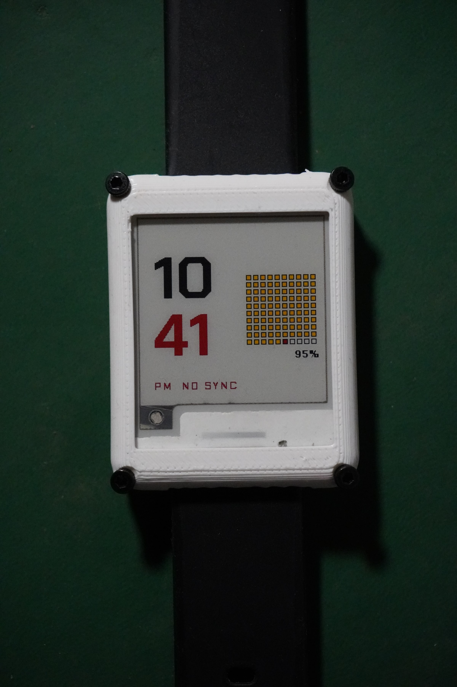

Chronos is the [e-paper watch](/projects/chronos): an ESP32-C3 on a custom PCB behind a 1.54", 200×200, four-colour panel (GDEM0154F51H), in a printed case on a strap. Every five minutes it wakes from deep sleep, draws one of thirteen faces, and goes back under. Once a day or so I had been telling people the battery would last weeks. This is the log of the first time I checked.

## The week before the test

The firmware went from a single Arduino sketch to a PlatformIO project in about two days, and most of that time was spent on things that were not the watch face.

The radio was first. At the default 19.5 dBm the board goes silent on its first transmit burst, and anything at or above 15 dBm stalls the CPU outright; the 3.3 V rail on my board simply cannot supply the peak. It runs happily at 8.5 dBm for an access point in the same room, so that is the cap, set in software, with a comment admitting it is a problem for the next PCB revision.

Deep sleep then took the serial port with it. The ESP32-C3's USB-Serial/JTAG port disappears when the chip sleeps, so uploading meant catching the board during its few seconds awake. The fix is `Serial.isPlugged()`, which watches for USB start-of-frame packets: a real host keeps the board idling awake between refreshes, and a charger or power bank does not count, so unplugging drops it straight back into deep sleep.

Then thirteen faces, chosen from fifty SVG concepts, each with its own fonts: ten Google Fonts TTFs converted to 36 bitmap font instances, about 49 KB in a single header. A PC-side renderer draws any face at any time with the same glyphs and the same drawing calls as the firmware, so layouts get checked without flashing. The wake interval moved from three minutes to five in the same commit.

That commit also switched to a 16 MB partition table, because I believed the module carried a W25Q128. The bootloader disagreed: `partition 3 ... exceeds flash chip size 0x800000`. `esptool flash_id` returned JEDEC `ef 4017`, which is a W25Q64, 8 MB. Back to `default_8MB.csv`. The firmware uses well under 1 MB, so nothing was lost except an afternoon.

## The test

Cell charged to 4.15 V, USB unplugged at 22:16 on 14 September, watch kept deliberately out of WiFi range for the whole run. Two questions at once: what does the worst case cost, and what does the clock do when it cannot sync.

It died at 15:54 on 16 September. That is 41 h 38 min, or roughly 500 wake cycles. Taking about 190 mAh as usable from a 200 mAh LiPo, the average draw comes to about 4.6 mA, or 0.38 mAh per cycle. Before the test I had estimated 0.31 mAh per cycle and about 50 hours. Missed by 17 %.

None of these numbers were metered; they are arithmetic from the clock on the wall. But the split is not hard to see in the code. WiFi is only touched when a sync is due, and once synced that means once every ten minutes. A watch that has *never* synced, though, has `g_timeSynced` false, and the same test fires on every single wake. So every five minutes it brought the radio up, ran a full channel scan, found nothing, and then did a blind `WiFi.begin()` and waited the full 8 s timeout anyway. Call it 11 s of radio at 90 to 115 mA per wake: around 0.27 mAh of the 0.38. The e-paper refresh is about 0.03. The remaining 0.07 or so over my estimate is the open question: either the deep-sleep floor is closer to 1 mA than I assumed (regulator, panel, pull-ups), or the radio phase is heavier than I think. That needs a meter in series with the battery, not more arithmetic.

If the firmware backs off when the SSID is not in the scan, skips the blind connect, and after a few misses only tries every 30 minutes or so, the same cell should manage 5 to 8 days. Where in that range depends entirely on the sleep floor.

## Five minutes

When I picked the dead watch up it had been reading five minutes ahead of real time. Over roughly 42 hours unsynced that is about +2000 ppm, about three minutes a day.

The likely reason is that the ESP32-C3's deep-sleep timer and its sleeping clock run on the chip's internal ~136 kHz RC oscillator, which is calibrated against the crystal at each boot but wanders with temperature; a residual of 0.1 to 0.3 % is normal for it. With WiFi in range the ten-minute resync hides this completely. Away from WiFi, which is what a wristwatch is for most of the day, it is the whole story. A 32 kHz crystal is not on the table as far as I can tell, because the RTC clock source is baked into the precompiled Arduino libraries.

The plan is to make the watch learn its own drift: at every sync, compute the ppm error since the last one, keep it in RTC memory seeded at −2000, and nudge the clock by `SLEEP_SECONDS × ppm` each wake. Not written yet.

## What is next

Away-from-WiFi backoff, drift compensation, and a multimeter in series during sleep to settle whether the floor is 0.2 mA or 1 mA. Then the same test again with WiFi in range, for the number that describes an ordinary day rather than the worst one.
