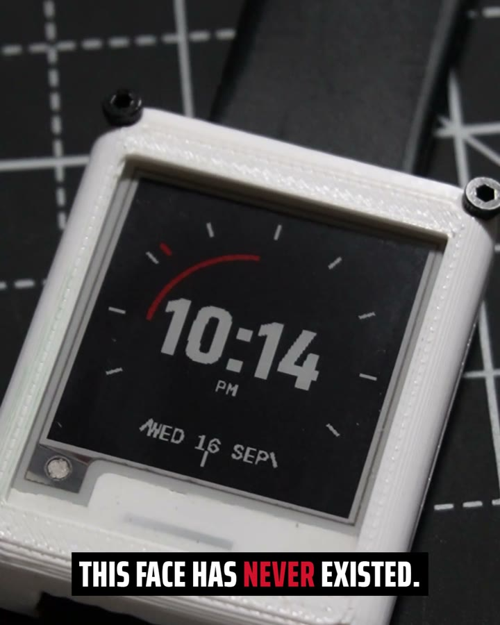
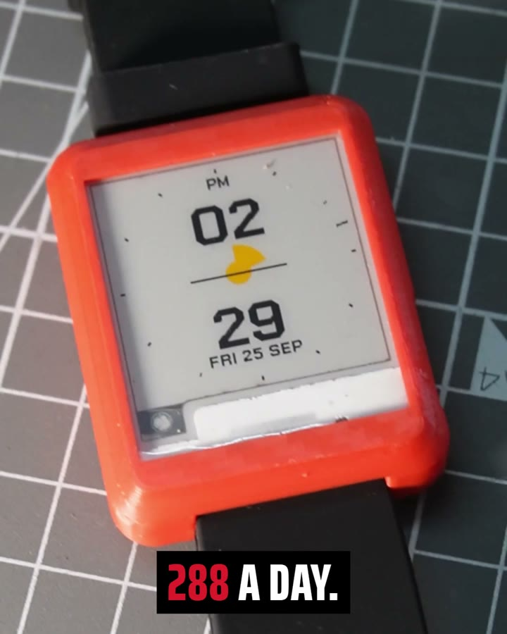

[Chronos](/projects/chronos) needed a reel: 30 seconds, vertical, 1080 by 1920. The material was a folder of 29 Sony clips, about 1.8 GB, and ten stills. The editor was ChatCut, a browser-based AI video editor, driven by Claude Code through ChatCut's MCP plugin. Claude looked at the footage locally with ffmpeg and built the timeline through tool calls, so the result stayed an ordinary editable project rather than a rendered black box.

## The first cut, and the plumbing

The first brief was "a reel showcasing my watch", and it got the reel that brief deserves: 1.2 s from the middle of each of the 29 clips, 35 s long, over a generated phonk track. Six clips were landscape and had to be rotated to fill the frame. The first guess, +90°, put every watch face upside down. −90° is right for this camera.

Getting there took more plumbing than editing. Importing through the browser failed with "No open editor is available": the Chrome tab Claude was driving kept freezing on ChatCut's loading screen, so I dragged the clips into the Media panel myself. The upload helper needed ffmpeg, which I did not have (`winget install Gyan.FFmpeg`), and then crashed anyway on Windows: it writes the temp path into an ffmpeg filter string, and the colon after `C:` breaks the filter parser. Running it from a scratch folder with `TMPDIR=.` worked.

## A proper brief

Then I replaced the brief with a real one: hook, proof, what it is, before, how, payoff, close; the e-paper refresh flash as the signature transition; hard-edged captions in the panel's own palette; a grade, grain, a vignette; a minimal-techno bed; two hook versions to A/B.

Claude scanned every clip at one frame per half second and measured luma and saturation frame by frame to find the refresh flashes. It found 14 distinct faces on camera and clean flashes in five clips. It generated a techno track, measured it at 119.7 BPM and sped it up by 1.0024x to lock it to 120, so one beat is exactly 15 frames at 30 fps, and cut 42 shots to that grid, with three photos standing in for footage I never shot.

It was precisely what I asked for, and the feedback rounds took it apart. Some captions showed "Can't render this motion graphic": ChatCut stores an empty text override as `null`, and the caption code called `.trim()` on it. An empty string, it turned out, is dropped on merge, so the old second line lingered; a single space clears it. The captions sat in the middle of the frame, on top of the watch, and said too much, so they moved to a lower band, one short line at a time. The grade lost detail on a display whose whole point is detail, and was deleted, all 84 instances across two timelines. Neither generated track suited, so I gave it my own, "daydreams": 30.6 s, 152.09 BPM, a beat every 0.3945 s, left at native speed.

## Fewer cuts

The round that fixed it was mine, and it contradicted my own brief. No photos. Stop switching shots so often. Let people register what they are looking at, and put the big reveal of the song on the big reveal of the watch. A montage of 0.2 to 0.8 s shots works for a product you recognise at a glance. A watch whose selling point is a face nobody has seen before needs time to be looked at.

The rebuild has 10 shots, each 2.4 to 3.6 s, all real footage. The hook is a tripod macro slowed to 0.68x. The refresh is one continuous clip: the black watch on 07:55 plays at 3.43x through the flash, and at 8.3 s, on the drop, falls to 1x as a new 08:00 face lands. No caption on that beat. Those are the three frames at the top of this page.

The rest was polish, and each piece had its own trap. Transitions felt abrupt, so every cut became a 6 to 10 frame dissolve with a quiet whoosh at −16 dB, and a bass riser at −10 dB leads into the reveal. Changing a clip's speed changes its length, and ChatCut then moves it to a new top track, over the captions, so track, start and length now get set together with the rate. Library sound effects are placed so their hit lands on the frame you give them, starting about 10 frames earlier; a 6-frame trim had cut the clock tick off entirely, and 14 frames brought it back. The reel fades in from black over 0.6 s and out over 1 s, so it loops black to black, and madebyanirudha.in sits top left.

When I changed the end card and nudged a caption by hand in the editor, Claude spotted both in its previews and left them alone. My summary of the tool at the end of the evening: "worked really well when given good prompt". The good prompt was the one that said what not to do.

## Still open

The frames above are from an earlier export, before the dissolves, the loop fades, the replaced shot and the watermark. The final version has not been exported yet. The edit also wrote a reshoot list: no footage of code or a laptop screen, no bare ESP32-C3, no PCB on video, nothing of the thirteen hand-drawn faces, so those beats were cut rather than faked. The house style is saved as a reusable reel-editing skill for Claude Code and as a ChatCut workflow skill, untested on a second project so far.
