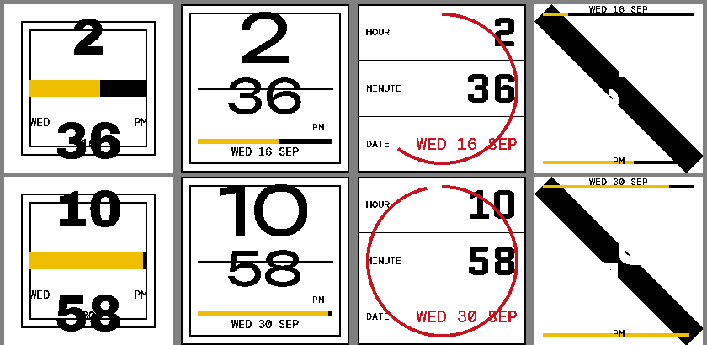
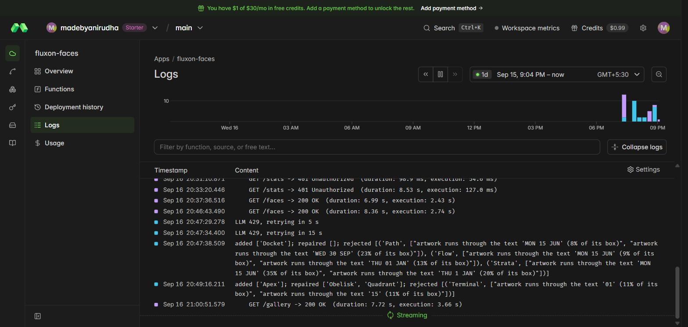
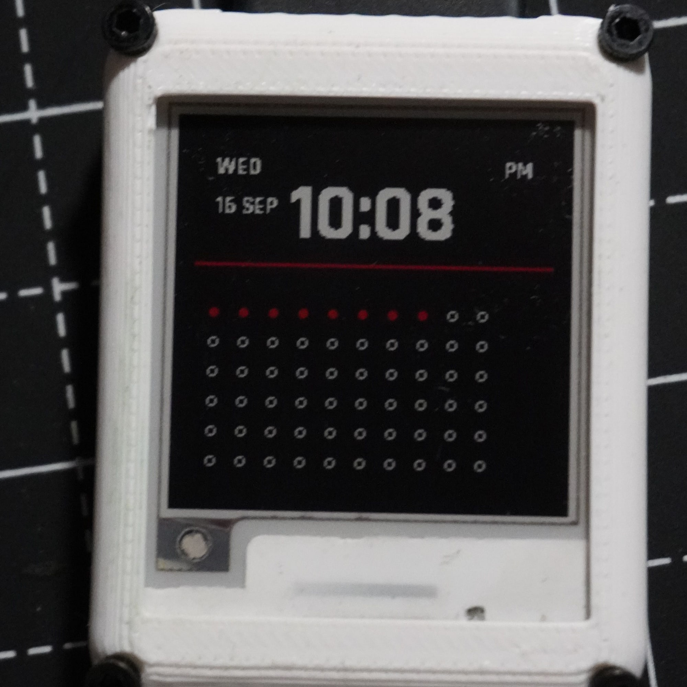
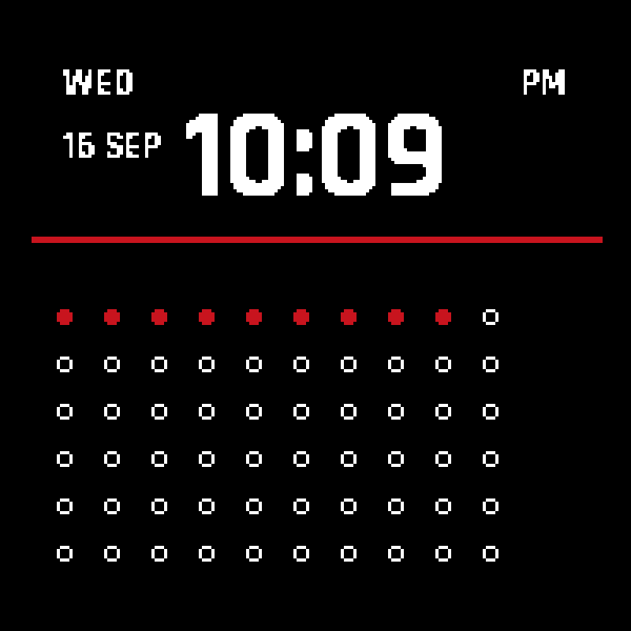
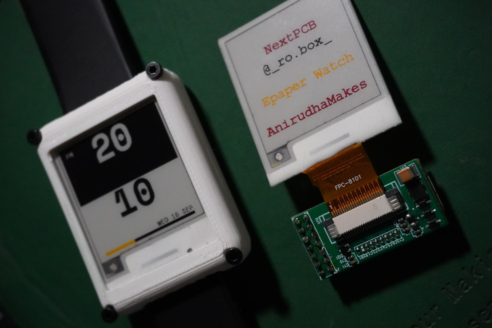
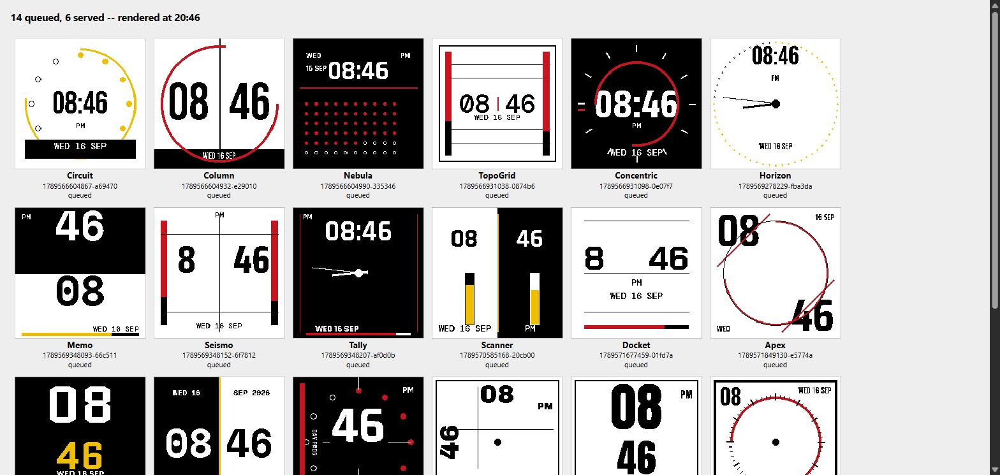

Until this evening the [e-paper watch](/projects/eink-watch) had thirteen faces, hand-ported and compiled into the firmware. Thirteen is enough to get bored of. The idea: never show the same face twice. Every five minutes, when the watch wakes anyway, it asks a server for a face that did not exist a few minutes ago. Two constraints, because this is a hobby: a free-tier language model, and Modal for hosting.

The rule that made it fit in one evening is that the LLM never draws a pixel and the watch never waits on the LLM. The model writes a small JSON drawing program: rects, circles, arcs, bars, tick rings, dots and hands driven by time variables, and text with `{H}` and `{MM}` placeholders. A scheduled job on Modal asks Gemini 2.5 Flash for four designs every 20 minutes, validates them, and banks the survivors in a Volume. A web endpoint pops a design that has never been served, renders it with the watch's own wall-clock time, and packs it into the panel's native format: two bits per pixel, `00` black, `01` white, `10` yellow, `11` red, four pixels per byte MSB-first, 10 000 bytes per frame. A packed frame decoded the panel's way diffed to zero against the PNG. The firmware just writes the bytes.

## The program is the art critic

The first Gemini run returned four designs and the validator passed all four. Two were unusable. Monolith drew the time in black on a black diagonal band: a handsome band, no time. Mixtape put the minute on top of the date. The validator had only checked geometry. It had no idea what was legible.

The checks now run on the rendered glyph mask. Text contrast against whatever is under it: the digits must come out visible at least 85 % of the time. Artwork crossing the numerals: no more than 2 % of the glyph box. Text on text, and anything off canvas. Each design is tried at three test times, the widest being 10:58 PM on Wednesday 30 September. A failure goes back to the model once with the validator's complaints, and the measured font metrics went into the prompt so the model can work out its own clear zones instead of guessing. Yield went from one clean design in four to seven in eight, and the logs now read like a patient reviewer: "artwork runs through the text 'MON 15 JUN' (8 % of its box)".

The free tier answers 429 and 503 often enough that one run was lost before retries went in, and the API key had been visible in the logged failure URL; it lives in a header now. The first deploy returned 422 on every route: `from __future__ import annotations` plus FastAPI imported inside the function, so the `Request` hint could not be resolved.

## The firmware side

`remote.cpp` is 205 lines. On each WiFi wake, on the connection NTP just used, one HTTPS GET brings back two frames, 20 024 bytes. Frame 0 goes to the panel through `display.writeNative()` and a `refresh()`. Frame 1 is stamped and parked in LittleFS as `/next.bin` for the following wake, which should not need the radio at all. The TLS client is `setInsecure()`: no CA bundle in flash, so the link is encrypted but the server is not authenticated. The built-in faces stay as the fallback, and the fetch finishes before the radio goes down: radio idle before the 11.7 s SPI refresh, as the watchdog investigation taught.

## Three wakes at the same spot

First WiFi wake: the TLS handshake failed with `SSL - The connection indicated an EOF`. Second: every TCP connect to port 443 timed out, Modal, example.com and Google alike, while DNS and NTP over UDP worked fine. Third, nothing changed: 27.7 s on the radio, and the watch showed Nebula.

Nebula is ten elements of JSON: a black page, the time top right, a red rule, and a ten-by-six grid of dots that fills one per minute. Here it is re-rendered from its stored program a minute later, which is what the endpoint packed and the panel drew.

The two failures were the link, not Modal and not TLS: RSSI −69 dBm at the 8.5 dBm transmit cap the board's 3.3 V rail imposes, through an onboard antenna that is my first attempt at one and has never been tuned. The successful fetch was 0.35 s of DNS, 4.1 s for TCP and TLS, 8.6 s waiting on the server, and about 14 s downloading 20 KB at roughly 1.4 KB/s. Of the server's 7 to 8 s, about 2.5 s was rendering; the rest was cold start. Twelve minutes later the watch was showing Memo.

By 20:46 the gallery showed 14 designs queued and 6 served; by 21:07, 16 queued. Four per call every 20 minutes is 288 a day, one per five-minute wake, with the bank capped at 400.

## Found while writing this up

The served list on the Volume shows fetches at 22:09, 22:14, 22:20, 22:25 and 22:31. Every wake. The parked second frame was never used: the fetch's 27 s awake pushed `sinceSync` past the "would run out before the next wake" rule, so every wake decided a sync was due, and WiFi ran twice as often as designed. The fix is a half-sleep margin in `main.cpp`, in the source and not yet flashed. It matters because 27 s on the radio is about 0.75 mAh per fetch, against the 0.38 mAh per whole cycle the battery test measured. Modal shows $0.00 of usage, with $0.99 of a $30 free tier unlocked until a payment method goes on the account.

Next: flash the margin fix and watch the log alternate between a fresh fetch and `face: remote cached`. Then the antenna, which is the real problem: compare RSSI with a phone at the same spot, a 31 mm wire monopole as a reference, an FPC antenna on an IPEX pigtail, and that connector on the next board. `WIFI_POWER_11dBm` is the one untested rung between 8.5, which works, and 15, which stalls the CPU. The face token needs rotating, having been pasted into a chat. And none of this is committed yet: six files.
