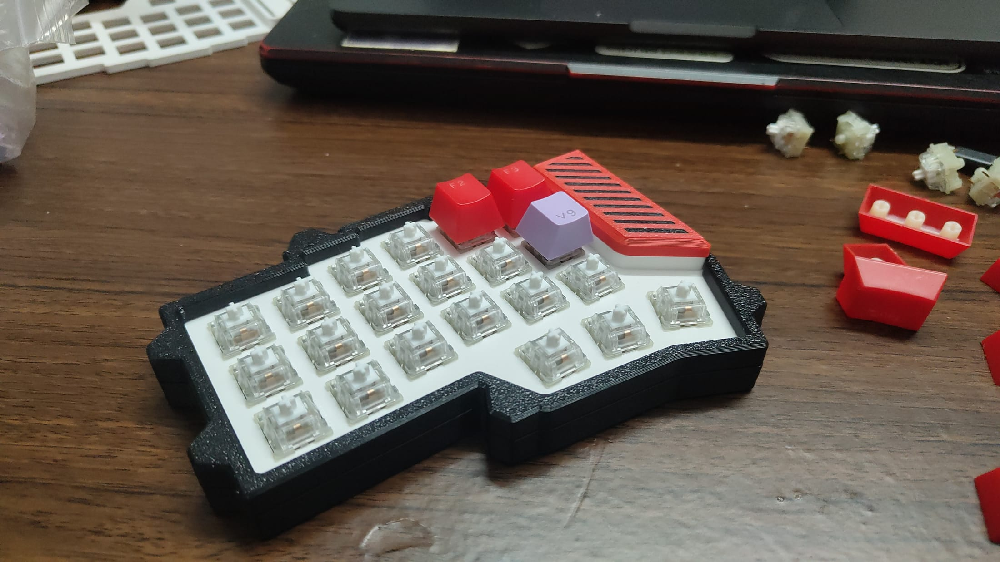
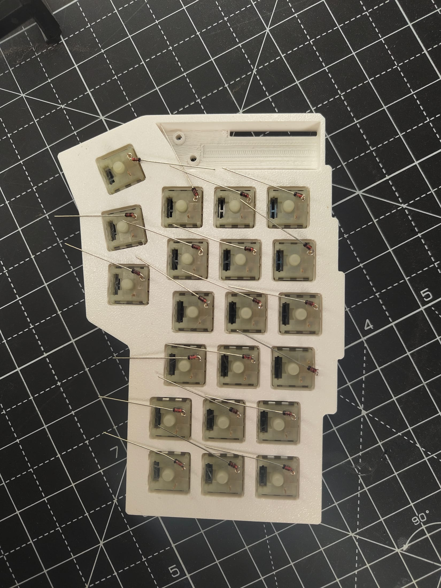
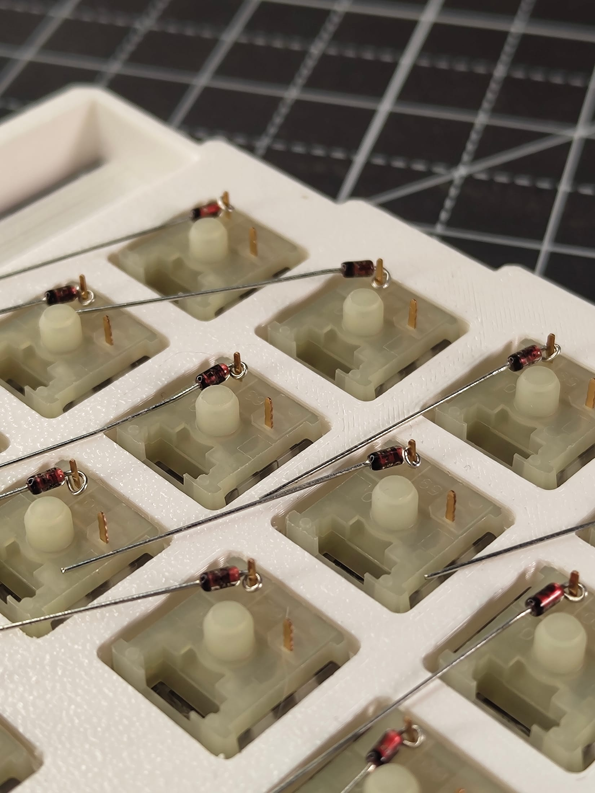
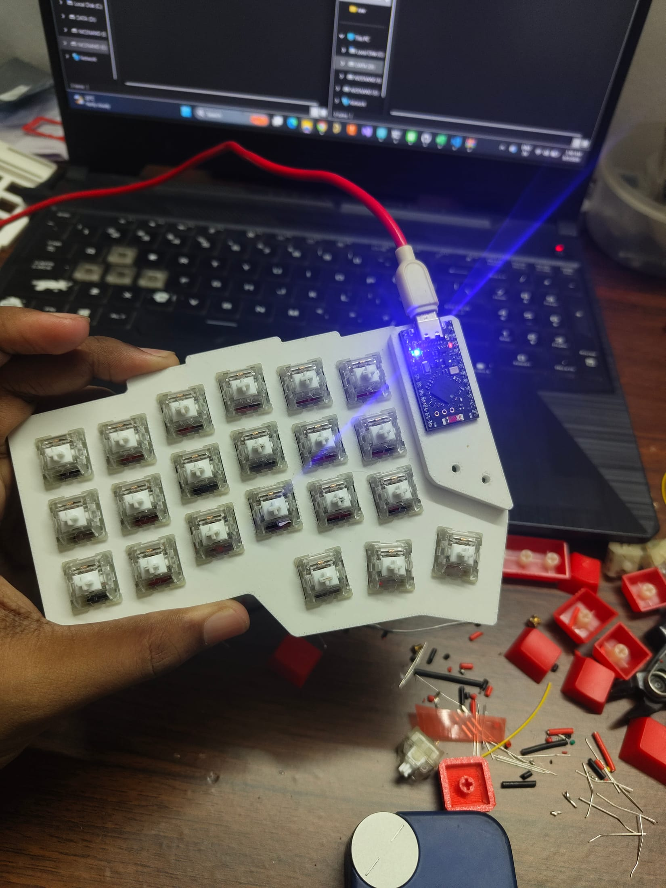
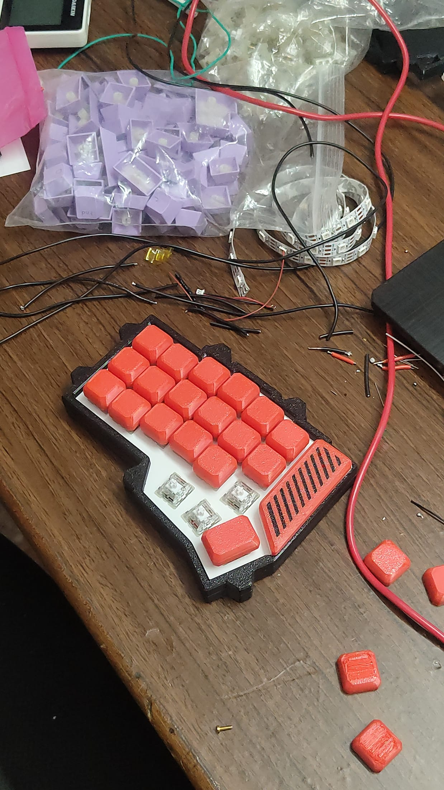
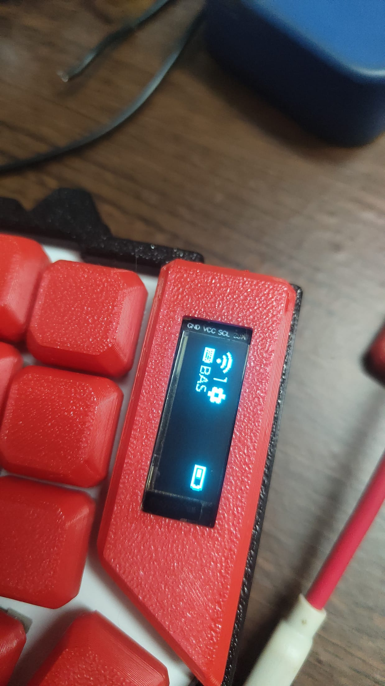
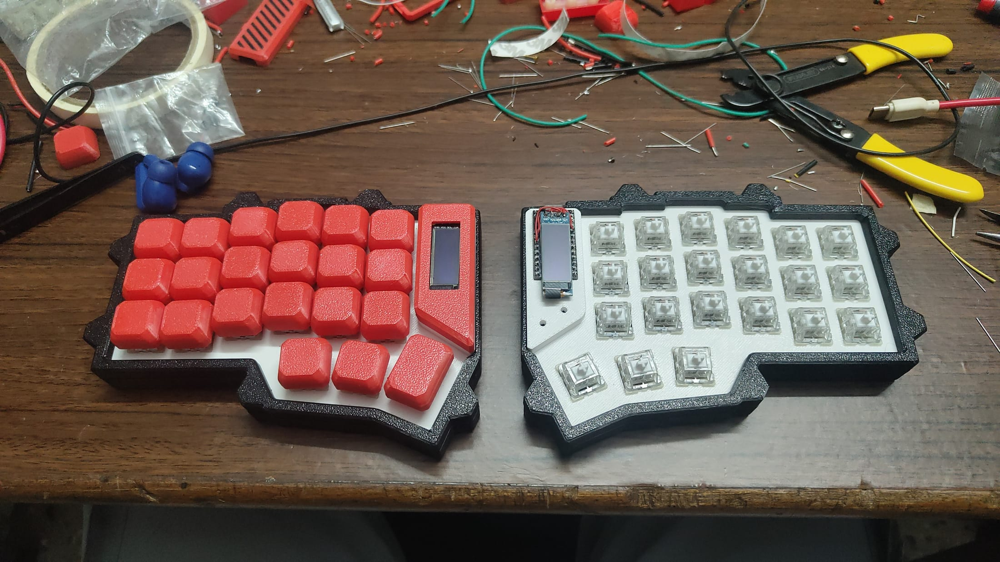
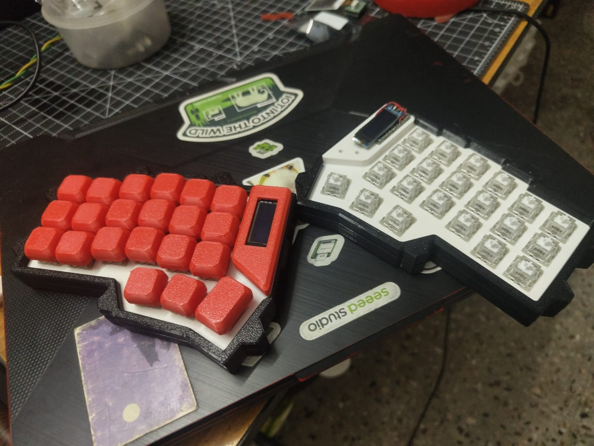
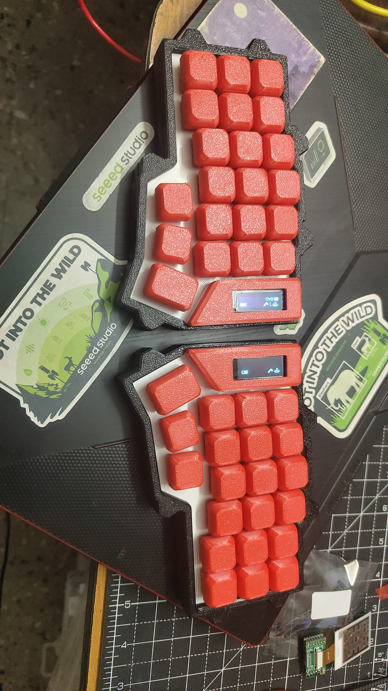
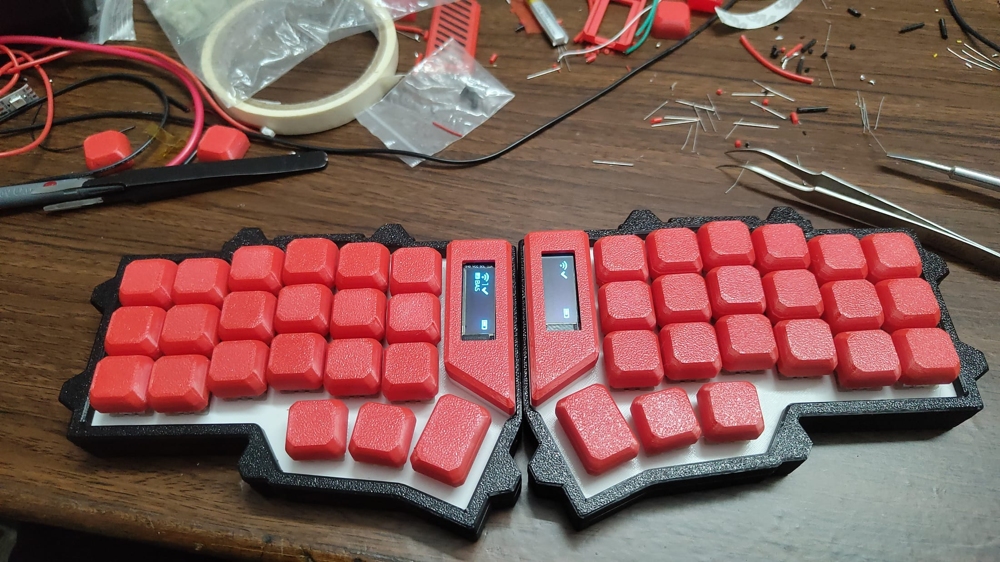

This is the bench side of [the keyboard post](/logs/keyboard-corporate-jargon-layer): the same build, photographed on a desk with a laptop, a soldering iron and nowhere to put anything. The photos run from 1 to 5 September.

## Diodes first

The first real wiring was on 2 September, on the cutting mat. Every switch gets one diode, bent and soldered to a switch pin, with the other leg left long to become a row wire. This is the `col2row` diode direction in the firmware overlay, and it is what lets 21 switches share a handful of pins on the nice!nano without ghosting. Left half, 21 diodes.

The slot along the top edge is the change from the tutorial: the MCU plate with room for the OLED. It prints as a long pocket with two screw holes, and it is the one part of this plate that was not in the original.

## First power

At 01:46 on 3 September, the nice!nano went onto the plate and a USB cable went into the laptop. The board's blue LED came on, and the laptop behind it has a file explorer open on the nice!nano's drive. That was the first moment the thing was a computer rather than a plate with opinions. Around it on the desk: red keycaps, cut diode legs, a yellow wire, a stray switch.

Later that morning the keycaps were on and the desk looked worse.

## The screen

On 4 September, just after midnight, the OLED came up. Text on a 128 × 32 panel is small enough to tell you immediately whether the wiring, the I2C address and the overlay are right.

The firmware comments have the two things I would check first if it had stayed blank: the VCC pad is gated by the board's external-power pin on P0.13, and some modules sit at address 0x3D rather than 0x3C. There is also a video from that afternoon of the iron going to the nice!nano's header pins, which I cannot put on this page yet.

That evening the left half was done and the right was still bare, switches fitted and the board sitting in the plate.

And a quick check of the right half once it had its screen, lit and still without caps, next to the finished left half.

## Done, on a mat

By 01:21 on 5 September both halves were finished and photographed on a cutting mat. By the evening they were back on the desk, next to tweezers and tape, because the desk is where they live.

The corporate layer came last, and it is in the firmware, not in any of these photos. The finished keyboard, photographed properly, is in [the main post](/logs/keyboard-corporate-jargon-layer).
