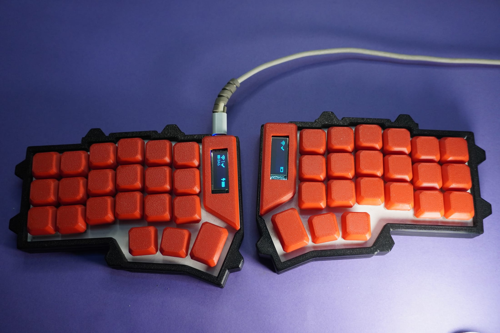
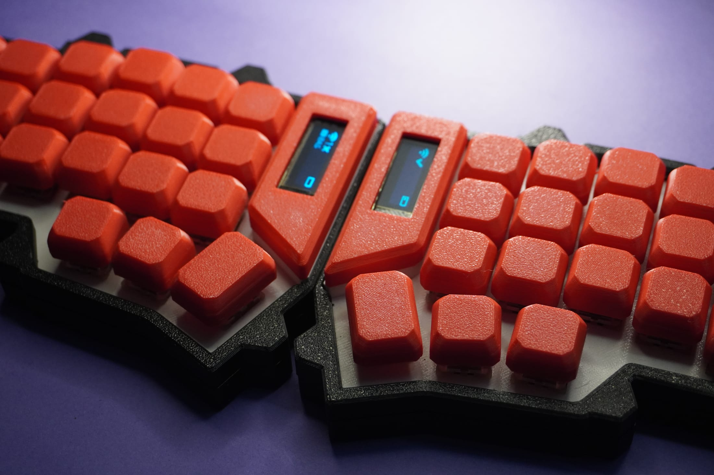
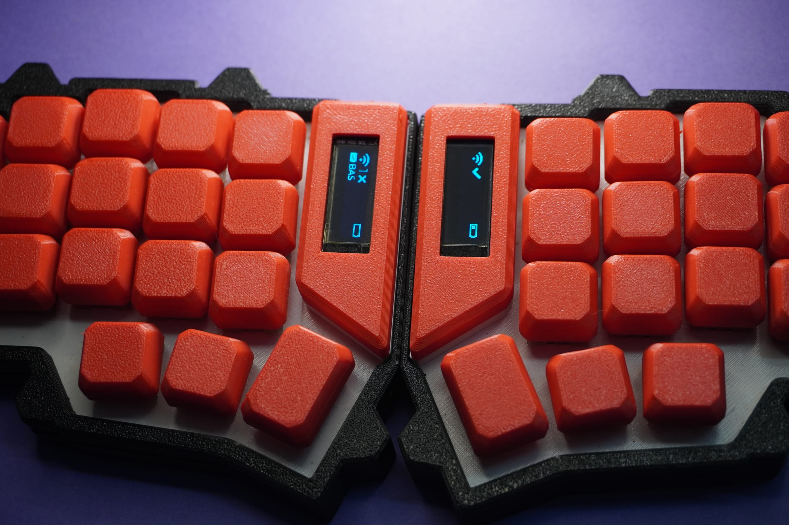
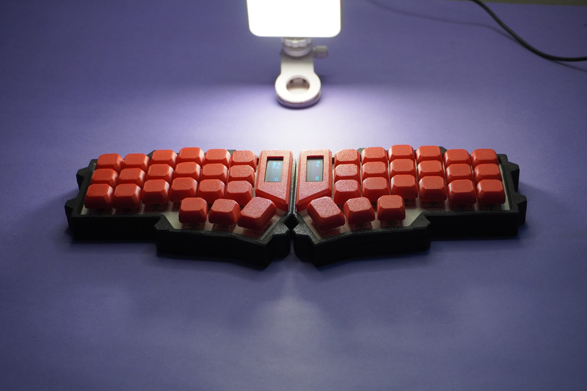

[The keyboard](/projects/keyboard) is a handwired, wireless split Corne built from the Sputnik design: 42 keys, a nice!nano on each half, ZMK firmware, printed case and keycaps. I followed the [open tutorial](https://github.com/vostoklabs/Sputnik-Handwired-Split-Corne-Keyboard-) for the build and changed two things. Each half now carries a small OLED, and there is a fourth layer that exists purely so I never have to type "per my last email" by hand again.



## A slot for the screen

The tutorial's MCU plate holds the nice!nano and nothing else. I edited the plate model to cut a slot for a 128 × 32 SSD1306 OLED beside it, and printed a red bezel to frame the glass. The same change goes into both halves, so the status screen is on the keys you can see, not on a board hidden under the case.



The wiring is four wires. VCC and GND from the nice!nano, SDA to D2 (P0.17) and SCL to D3 (P0.20), which are the board's hardware I2C pins. In the firmware the screen is a `ssd1306@3c` node in each half's shield overlay, and `CONFIG_ZMK_DISPLAY=y` turns the status screen on. It shows the connection state, the battery, and the name of the active layer, which is why the layers in the keymap have display names: `BAS`, `LOW`, `RAI` and now `CORP`.



## The layer

Hold both thumb layer keys, LWR and RSE, and the keyboard drops into layer 3. ZMK calls this a conditional layer: when layers 1 and 2 are both active, layer 3 turns on, and the OLED switches to `CORP`. Every key on it types a whole phrase.

- **BIGTHX**: `BIG THANK `
- **LFG**: `LFG!! `
- **CIRCLE**: `Circling back on this. `
- **PERLST**: `Per my last email, `
- **OFFLIN**: `Let's take this offline. `
- **OCEAN**: `Let's not boil the ocean here. `
- **SHIPIT**: `Ship it! `
- **DROPOF**: `Sorry, dropping off - I have another call. `

That is 40 phrases in all, from `LGTM` down to the sign-off, on the three alpha rows and four of the six thumb keys. The two thumb keys you are holding stay transparent, because binding them would drop the layer you are standing on. Each phrase ends in a space, so the cursor is ready for the next word.

Typing a phrase in ZMK means one `&kp` per character, so I did not write them. A short Python script, `tools/gen_corporate_layer.py`, holds the phrases in tables and rewrites everything between two `GENERATED` markers in the keymap. Change a phrase, run the script, rebuild.

```
// "Ship it! "
m_shipit: m_shipit {
    compatible = "zmk,behavior-macro";
    #binding-cells = <0>;
    wait-ms = <5>;
    tap-ms = <5>;
    bindings = <&kp LS(S) &kp H &kp I &kp P &kp SPACE &kp I &kp T &kp EXCL &kp SPACE >;
};
```

The one trap is the queue. Every character is a press and a release, so the longest phrase, 43 characters, needs 86 events, and ZMK's default macro queue holds 64. The long phrases would not fail. They would simply stop in the middle of a word. `CONFIG_ZMK_BEHAVIORS_QUEUE_SIZE=256` fixes that.

## Smaller things the firmware taught me

ZMK limits the Bluetooth name to 16 characters and asserts it at build time. "Anirudha's Keyboard" is 19, so the keyboard is "Anirudha's Keeb". The name is also stored in settings, so flashing new firmware does not rename the device: flash `settings_reset` first, let it boot, then flash the real firmware back. The other layers are a coding layer, with navigation, redo, the command palette and a terminal toggle on the left hand, and a symbols layer with the F-keys. The keyboard sleeps after 10 minutes idle.



The less glamorous half of this build, with the wire clippings and the wrong turns, is in [the build log](/logs/keyboard-build-log-bench-notes).
